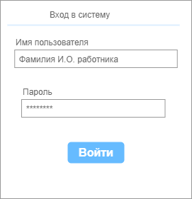

# Требования к проекту

## Содержание

* [1. Введение](#intro)
    * [1.1 Назначение документа](#doc)
    * [1.2 Бизнес-требования](#bisness_requirement)
        * [1.2.1 Исходные данные](#source)
        * [1.2.2 Возможности](#posibilities)
    * [1.3 Границы проекта](#limitation)
* [2. Требования пользователя](#requirement)
    * [2.1. Программные интерфейсы](#prog_interface)
    * [2.2. Пользовательский интерфейс](#user_interface)
    * [2.3. Пользовательские функции](#user_functions)
* [3. Системные требования](#sys_requirement)
    * [3.1 Функциональные требования](#func_requirement)
    * [3.2 Нефункциональные требования](#usability)
* [4. Описание проекта](#project_discription)
   
* [5. Аналоги](#analogues)

1. Введение

Десктопное приложение "Управление автостоянкой" будет представлять из себя программу объединения всей необходимой информации для удобного и эффективного распределения машиномест на автостоянках, а так же для осуществления контроля зоны ответственности во времени. Так же это приложение будет полезно управляющим автостоянкой для оценки статистических данных по занятости машиномест и рентабельности.

1.1 Назначение документа

В этом документе описаны функциональные и нефункциональные требования к десктопному приложению «Управление автостоянкой». Этот документ предназначен для команды, которая будет реализовывать и проверять корректность работы приложения.

1.2 Бизнес-требования

1.2.1 Исходные данные

Управление автостоянкой это не очень сложный процесс, но очень нагруженный и с высокой долей ответственности (в т.ч. материальной). Существует достаточное количество автостоянок, которые по сей день управляются, так сказать, вживую, т.е. основным контролирующим ресурсом являются не технические средства (автоматические системы оплат, автоматические шлагбаумы и считыватели гос.номеров и т.д.), а на многих автостоянках всё основано на охраняемом периметре и контрольно-пропускных пунктах, на которых находятся люди отвечающие за движение автомобилей и распределения автомобилей по территории. Это особенно необходимо большегрузам, которым запрещено заезжать в большие города для временных ночёвок, и водители таких автомобилей пользуются именно не автоматическими паркингами, а охраняемыми стоянками под "ручным" управлением.

1.2.2 Возможности для бизнеса

Данная программа предназначена для сбора фактической информации в единое хранилище взамисвязанных данных, что позволит видеть и выбирать любые связанные данные и компоновать их в отчёты моментально. Это сильно ускорит процесс обработки данных, а так же позволит сократить бюрократические проволочки и возможно часть администраторского персонала.

1.2.3 Границы проекта

Данное программное приложение прежде всего предназначено для некольких копьютеров соединённых между собой по локальной сети с установленными приложениями на каждом компьютере один из которых так же будет хранить в себе базу данных.

Данное приложение не предполагает удалённого контроля из вне локальной сети, т.к. это потребует дополнительной разработки в модели "клиент-серверного" приложения.

2. Пользовательские требования

2.1 Программные интерфейсы

Проект будет написан на языке Java. Пользовательский интерфейс будет реализован на библиотеке по решению тех.лида и согласованию с заказчиком. Для хранения данных будет использована база данных MySQL.

2.2 Пользовательский интерфейс

ToDo: Мокап основного окна с меню

Мокап окна с формированием отчёта по клиентам

Мокап окна для занесения даты/времени проезда автомобиля через КПП

Мокап окна просмотра списка автомобилей на стоянке или проехавших за любой прошедший период

// Здесь нужны Мокапы некоторых страниц интерфейса с коротким описанием (одно - максимум два предложения о том, что это за "окно")

2.3 Характеристики пользователей

|Класс пользователей|Описание|
|---|---|
|Охранник|Работники, которые осуществляют фиксацию проезда автомобилей через КПП в базу|
|Администратор|Работники, которые заключают договора, заносят в базу клиентов, договора, данные по автомобилям, машиноместам|

2.3.1 Целевая аудитория приложения

Администраторы, которые имеют как минимум среднее-специальное образование с экономическим уклоном, и охранники, которые могут иметь как минимум среднее бразование.

2.4 Пользовательские функции

2.4.1 Основные функции

2.4.1.1 Вход пользователя в систему (для всех пользователей)

|Функция|Требования|
|---|---|
|Вход в приложение|Приложение должно предоставить пользователю возможнось ввести свои данные, проверить наличие такого пользователя среди списка работников и, в зависимости от должности, предоставить доступ к программе в режиме функционала, соответствующего занимаемой должности|

2.4.1.2 Возможности пользователей группы "Администратор"

|Функция|Требования|
|---|---|
|Выбрать таблицу в БД, в которую пользователь будет производить запись|Приложение должно дать возможность пользователю выбрать из списка тот тип данных, который он собирается пополнять (выбрать таблицу в БД, с которой он собирается работать)|
|Сделать запись в базу данных|Приложение должно проверить заполнение полей для записи в БД и предоставить пользователю возможность дописать недостающие данные в полях, а после этого уведомить пользователя об успешном создании записи|
|||
|||
|||
|||

3. Системные требования

На компьютере должна быть установлена любая ОС, поддерживающая Java 8.

3.1. Функциональные требования

Данное приложение предполагает:
 - распределение автомобилей по машиноместам;
 - мониторинг машиномест по критерию "занято/свободно/зарезервированно"; 
 - фиксацию договоров с оплатой услуг, для рассчёта полученной и недополученной прибыли; 
 - контроль и регистрация заездов транспортных средств, с фиксированием даты и время заезда/выезда под ответственное хранение; 
 - учёт клиентов и автомобилей;
 - автоматический рассчёт стоимости, а так же возможность предоставления индивидуальных скидок для постояных клиентов, в зависимости от длительности пользования услугами данной автостоянки;
 - хранение данных о сотрудниках и распределении их по КПП с графиком работы;
 - формирование различных аналитических отчётов по имеющимся в базе данным
 - минимизация ошибок ввода, уменьшение времени на обработку заявки;
 - вход в "систему" с любого из компьютеров локальной сети, но под своим логином и паролем;
 - возможность импорта и экспорта данных средствами БД.

3.2. Нефункциональные требования

- Приложение должно предоставлять удобный и интуитивно понятный интерфейс с учётом уровня образования пользователей
- Приложение должно давать возможжность быстрого перехода между режимами в пару кликов мышкой и иметь привязку к горячим клавишам
- Приложение должно иметь заготовленные запросы к БД, спрятанные за клавишами и доступные пользователю в виде понятных меню, кнопок с подсказками
- Пользователь не должен беспокоиться о безопасности клика на любой активный элемент окна; всё что может привести к некорректной работе системы пользователю недоступно.

4. Описание проекта

4.1 Создать приложение, которое будет объединять фактические данные в единую реляционную БД, и давать возможность быстро и доступно для понимания модифицировать данные, компоновать их в виде различных удобных для восприятия отчётов.

4.2 Пользователь должен авторизоваться в системе под своей фамилией, после чего они получают доступ в систему с функционалом, соответствующим занимаемой им должности. Перемещаясь по меню типа "вкладок", он может выбрать любую вкладку для работы и при переключении на другую вкладку для дополнительного уточнения данных, то, что было введено на предыдущей вкладке не должно теряться. При выходе из системы, пользователь должен сохранить данные и закрыть приложение.

4.3 При потере связи с БД, у пользователя должна быть возможность временного сохранения данных у себя на локальном компьютере, чтобы при возобновлении связи эти данные были дополнены в БД без повторного набора их на компьютере.

5. Аналоги

На данный момент времени на просторах интернет-реурсов сложно найти подобное программное обеспечение. В основном рынок наполнен системами автоматических парковок, которыми снабжаются платные стоянки в больших городах предназначенные для легковых автомобилей и мини-грузовиков. И стоимость программного обеспечения для таких систем в базовой комплектации от 15`000 долларов.